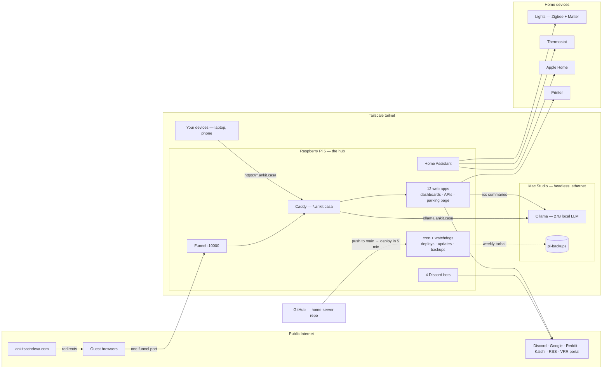
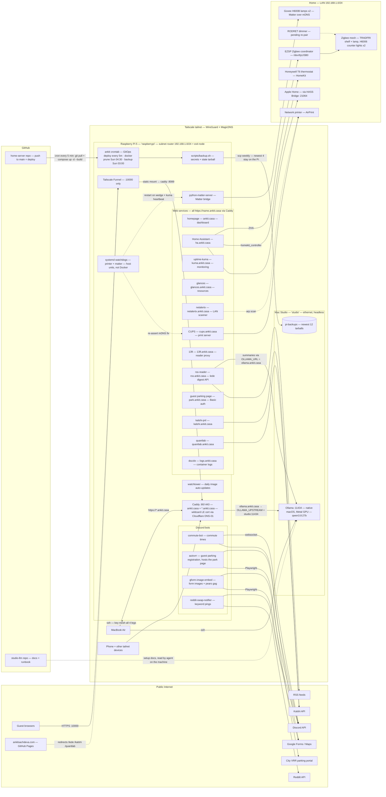

# Home Server

A complete home server setup running on Raspberry Pi with Docker containers.

## Services

### Home Automation
- **[Home Assistant](./home-assistant/)** - Home automation hub (port 8123, host network)
- **[Matter Server](./matter-server/)** - Matter protocol bridge (internal)

### Dashboard & Monitoring
- **[Homepage](./homepage/)** - Dashboard (https://ankit.casa — Caddy only, no host port)
- **[Uptime Kuma](./uptime-kuma/)** - Service monitoring (https://kuma.ankit.casa; port 3001 bound to localhost for the host watchdogs' heartbeats)
- **[Glances](./glances/)** - System resource monitoring (https://glances.ankit.casa — Caddy only, no host port)
- **[Dozzle](./dozzle/)** - Container log viewer (https://logs.ankit.casa — Caddy only, no host port)

### Network
- **[NetAlertX](./netalertx/)** - Network device scanner (port 20211, host network)

### Services
- **[Caddy](./caddy/)** - HTTPS reverse proxy for ankit.casa + *.ankit.casa (ports 80/443; wildcard Let's Encrypt cert via Cloudflare DNS-01, built from the official image with xcaddy)
- **[CUPS](./cups/)** - Print server (port 631, host network)
- **[13ft](./13ft/)** - Paywall bypass reader proxy (https://13ft.ankit.casa — Caddy only, no host port)
- **[RSS Reader](./rss-reader/)** - RSS digest service for lede (JSON API; public via Funnel :10000 → caddy `/lede` route, feeds ankitsachdeva.com/lede)
- **[Kalshi PnL](./kalshi-pnl/)** - Lifetime Kalshi profit/loss JSON API (public via Funnel :10000 → caddy `/` route for ankitsachdeva.com/kalshi — response is the net number only; secrets scp'd by hand, see its README)
- **[Quantlab](./quantlab/)** - Backtest + Kalshi arbitrage API (public via Funnel :10000 → caddy `/quantlab` route for ankitsachdeva.com/quantlab, see its README)
- **Ollama** (moved off the Pi — see the [studio-llm](https://github.com/ankitsxchdeva/studio-llm) repo) - Local LLM running natively on a Mac Studio (Metal GPU); consumers reach it at `https://ollama.ankit.casa` via Caddy over the tailnet. rss-reader uses it to summarize items and write a daily themes overview; quantlab uses it as the default keyless provider for strategy compilation

### Discord Bots
- **[Commute Bot](./commute-bot/)** - Commute time lookup via Google Maps
- **[AutoVRR](./autovrr/)** - Visitor parking registration automation. Also serves the guest parking web page (tailnet at park.ankit.casa; public via a Funnel :10000 → caddy path route at an unguessable path — PARK_PUBLIC_PATH in caddy/.env)
- **[Google Form Image Embed](./gform-image-embed/)** - Replies with images extracted from Google Forms links
- **[Reddit Swap Notifier](./reddit-swap-notifier/)** - Pings you on Discord when new swap-subreddit posts match your keywords

### Deprecated
Retired services live in [`deprecated/`](./deprecated/) and are excluded from the main compose file:
- **Pi-hole** - was never used as a DNS server by any LAN client
- **Traefik** - reverse proxy; only ever routed the wg-easy UI, otherwise served internet scanners
- **wg-easy (WireGuard)** - never worked externally: UDP 51820 was not forwarded and `vpn.ankit.casa` was Cloudflare-proxied (Cloudflare doesn't carry WireGuard UDP). Replaced by Tailscale.

## Architecture

Everything below is deployed by GitOps — push to `main` and the Pi pulls and rebuilds within 5 minutes.



<details>
<summary>Full detail — every service, port, and flow</summary>



</details>

How it fits together:
- **Ingress:** Caddy serves `*.ankit.casa` (tailnet-only DNS) with a real wildcard cert. The public internet reaches the Pi through exactly one Tailscale Funnel port (10000), which proxies to a static localhost Caddy listener — every public route lives in the Caddyfile.
- **Compute split:** the Pi runs every service except inference. The Mac Studio runs Ollama natively (Metal GPU) behind `ollama.ankit.casa` and holds the off-box backup tarballs.
- **Smart home:** HA talks Zigbee (EZSP USB stick, ZHA), Matter (mDNS via matter-server), and HomeKit (thermostat in, HASS Bridge out to Apple Home). Two host-level systemd watchdogs keep printer discovery and Matter nodes alive.
- **Safety net:** weekly backup tarballs land on the Studio (`~/pi-backups`); RESTORE.md rebuilds the Pi from bare SD + tarball.

## Remote Access (Tailscale)

The Pi is on the tailnet (`raspberrypi`, MagicDNS enabled) and is configured as:
- **Subnet router** advertising `192.168.1.0/24` - remote devices on the tailnet can reach the whole LAN
- **Exit node** (optional full-tunnel routing)

Subnet routes / exit node must be approved in the Tailscale admin console after (re)advertising. One Tailscale Funnel serves all public traffic on https://raspberrypi.tail9476fb.ts.net:10000 — `/` → kalshi-pnl (feeds ankitsachdeva.com/kalshi), `/lede` → rss-reader (feeds ankitsachdeva.com/lede, github.com/ankitsxchdeva/lede), `/quantlab` → quantlab, and the park page at an unguessable path. Do not remove it.

Funnel supports only ports 443, 8443 and 10000, and 443 cannot be funneled at all because Caddy already binds `0.0.0.0:443`, which covers the tailnet address tailscaled would need. One mount on :10000 is all we need: it proxies to a **static localhost Caddy listener** (`127.0.0.1:8089`), and every public route lives in [`caddy/conf/Caddyfile`](./caddy/conf/Caddyfile)'s `:8089` block. `handle_path` strips each route's prefix before proxying, so the backend sees `/api/run`, not `/quantlab/api/run`. **New public exposure = add a route to the `:8089` block; no host change, no new funnel mount.** The park path is `PARK_PUBLIC_PATH` in `caddy/.env` (fail-closed if unset).

The funnel mount itself is host state, not Docker state — it survives `docker compose down` but must be re-created on a rebuild (one command; see [RESTORE.md](./RESTORE.md)).

`ankit.casa` and `*.ankit.casa` resolve (unproxied Cloudflare DNS) to the Pi's Tailscale IP, so every URL below works from any tailnet device anywhere, with a real Let's Encrypt certificate, and is unreachable from the public internet.

## Automation & Scheduled Jobs

| Job | Schedule | What it does |
|---|---|---|
| GitOps deploy (`crontab -l`) | every 5 min | `git fetch`; if `origin/main` changed: `git pull && docker compose up -d --build`, then a graceful caddy reload (caddy `--watch` doesn't survive git's inode swap; the reload makes Caddyfile-only changes self-apply). Push to main = deploy. |
| Docker prune (`crontab -l`) | Sun 04:30 | `docker system prune -af --filter "until=168h"` — clears week-old unused images and build cache from GitOps builds |
| Backup (`crontab -l`) | Sun 03:00 | `sudo scripts/backup.sh` — secrets+state tarball to `/home/ankit/backups` (newest 4) + scp copy to the Mac Studio `~/pi-backups` (newest 12). Log: `scripts/backup.log` |
| Watchtower | daily ~04:00 UTC | Auto-pulls new images and recreates containers (skips locally-built images). Runs the maintained fork `nickfedor/watchtower` (original containrrr project is unmaintained). |
| Printer watchdog (`systemd` timer — **host unit, not Docker**) | every 5 min | Re-asserts the CUPS/avahi mDNS fix (the recurring "can't reach printer" bug) and heartbeats uptime-kuma. Units + script live in [`scripts/printer-watchdog.*`](./scripts/printer-watchdog.md); installed manually on the host, so it must be re-installed on a rebuild (not covered by GitOps). |
| Matter watchdog (`systemd` timer — **host unit, not Docker**) | every 5 min | matter-server stops retrying its nodes after a network outage and never recovers, while the container still reports `Up` and `/info` still returns 200. Checks real node availability and restarts the container — gated on LAN-up, 3 consecutive failures, and max 1 restart/hr — then heartbeats uptime-kuma. See [`scripts/matter-watchdog.*`](./scripts/matter-watchdog.md); host install, so re-install on a rebuild. The matching container healthcheck *is* GitOps-covered. |

Retired 2026-07-11: the Cloudflare DDNS cron and the homepage IP-monitor timer (both in `deprecated/`) — both obsolete now that the dashboard links use the stable Tailscale IP and nothing is served over the public internet.

## Disaster Recovery

[RESTORE.md](./RESTORE.md) is the bare-SD-card-to-running rebuild runbook.
[`scripts/backup.sh`](./scripts/backup.sh) bundles the parts git can't hold
(`.env` secrets, Zigbee/Matter pairings, HA config, monitor/subscription DBs) —
runs weekly (Sun 03:00 cron) and pushes a copy off-box to the Mac Studio
(`~/pi-backups`); manual run: `sudo scripts/backup.sh`.

## Quick Start

1. **Setup environment files:**
   ```bash
   cd home-server
   # Copy and configure .env files for each service
   for dir in caddy homepage home-assistant glances netalertx cups rss-reader commute-bot autovrr gform-image-embed reddit-swap-notifier; do
     cp $dir/.env.example $dir/.env
   done
   # Edit each .env with your actual values
   # (caddy/.env needs a real Cloudflare API token or the wildcard cert can't issue)
   ```

2. **Start all services:**
   ```bash
   docker compose up -d
   ```

3. **Stop all services:**
   ```bash
   docker compose down
   ```

4. **Start a single service:**
   ```bash
   docker compose up -d <service-name>
   # e.g.: docker compose up -d homepage
   ```

## Access URLs

All served HTTPS by Caddy (http redirects to https):

- **Dashboard**: https://ankit.casa
- **Home Assistant**: https://ha.ankit.casa
- **Uptime Kuma**: https://kuma.ankit.casa
- **Glances**: https://glances.ankit.casa
- **NetAlertX**: https://netalertx.ankit.casa
- **CUPS Print Server**: https://cups.ankit.casa
- **13ft Reader**: https://13ft.ankit.casa
- **RSS Reader**: https://rss.ankit.casa/docs (JSON API; Swagger UI)
- **Guest Parking**: https://park.ankit.casa (login page + session cookie; also public via the Funnel :10000 path route at an unguessable path — PARK_PUBLIC_PATH in caddy/.env)
- **Kalshi PnL**: https://kalshi.ankit.casa/pnl (JSON API; also public via Funnel :10000)
- **Quantlab**: https://quantlab.ankit.casa (full UI + API; also public at https://raspberrypi.tail9476fb.ts.net:10000/quantlab via Funnel)
- **Dozzle**: https://logs.ankit.casa
- **Ollama**: https://ollama.ankit.casa (OpenAI-compatible LLM API at `/v1`; served natively by the Mac Studio over the tailnet — no web UI, no host port on the Pi.)

Direct `http://<pi>:<port>` access remains only where something actually needs it: the host-network services (8123 HA, 20211 NetAlertX, 631 CUPS), uptime-kuma's 3001 bound to localhost for the watchdogs, and caddy's localhost funnel listener (8089). Everything else is Caddy-only — `https://name.ankit.casa` is the single door. Ollama is the exception: it isn't on the Pi at all — native on the Mac Studio, reachable only via `ollama.ankit.casa`.
